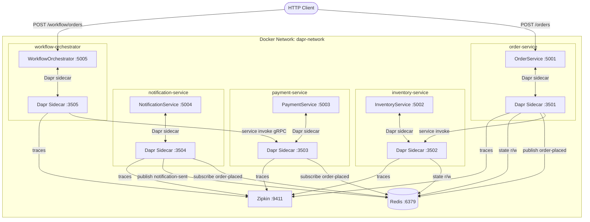
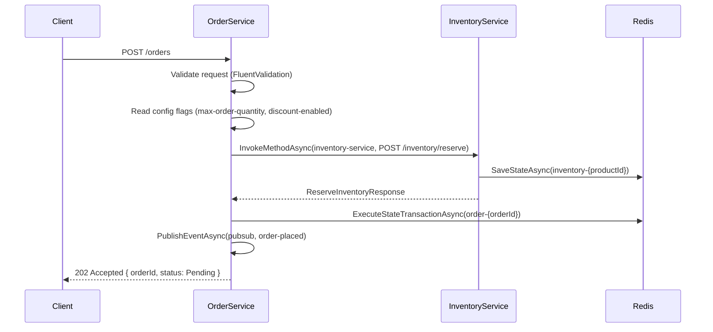
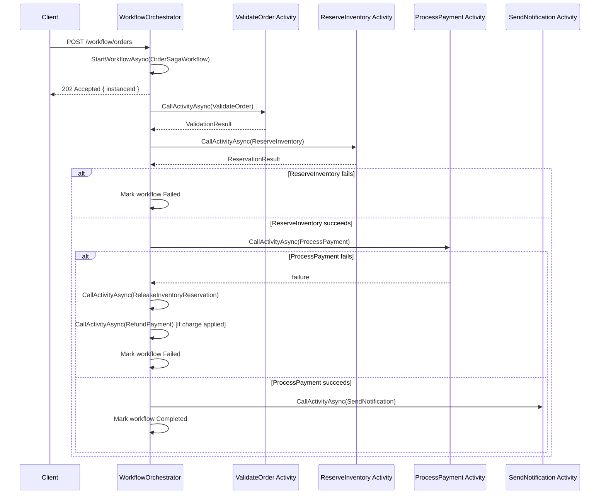
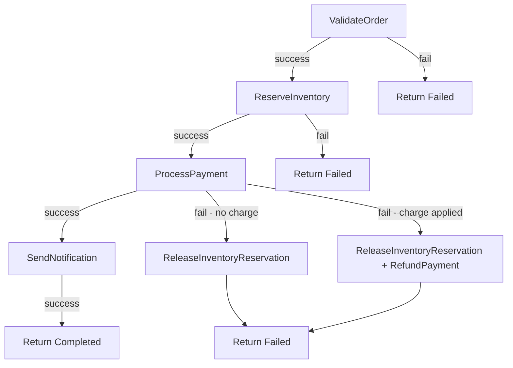

# Design Document: SmartOrder

## Overview

SmartOrder is a .NET 10 microservices application demonstrating all major Dapr building blocks through a realistic e-commerce order processing pipeline. Five services collaborate to handle the full order lifecycle: placement, inventory reservation, payment processing, and customer notification. A saga pattern via Dapr Workflow coordinates distributed transactions with compensation on failure.

The system is designed to run locally via a single `docker-compose.yml` and is structured so each service is independently deployable. All inter-service communication goes through Dapr sidecars — no direct HTTP calls between services.

### Design Goals

- Demonstrate every Dapr building block: service invocation, pub/sub, state management, workflow, secrets, configuration, resiliency, and observability
- Enforce consistent .NET 10 patterns: Minimal APIs, record DTOs, async/await with CancellationToken, structured logging
- Keep each service independently testable with mocked `IDaprClient`
- Provide a realistic saga with compensation that developers can study and extend

---

## Architecture

### System Topology



### Request Flow: Order Placement (Direct API)



### Request Flow: Order Saga (Workflow)



---

## Components and Interfaces

### OrderService

**Dapr App ID:** `order-service`  
**Port:** 5001 (HTTP), 3501 (Dapr sidecar)

#### Endpoints (`Endpoints/OrderEndpoints.cs`)

| Method | Path | Description |
|--------|------|-------------|
| POST | `/orders` | Create a new order |
| GET | `/orders/{orderId}` | Retrieve order by ID |
| GET | `/health` | Health check |

#### Services (`Services/`)

- `OrderService` — core business logic: validate, persist, publish
- `OrderStateService` — wraps all Dapr state operations with ETag handling
- `ConfigurationService` — reads and subscribes to feature flags from ConfigStore

#### Key Interactions

- Calls `InventoryService` via `DaprClient.InvokeMethodAsync("inventory-service", "inventory/reserve", ...)`
- Saves order state via `DaprClient.ExecuteStateTransactionAsync("statestore", ...)`
- Reads/updates order via `DaprClient.GetStateAndETagAsync` + `DaprClient.TrySaveStateAsync`
- Publishes `OrderPlacedEvent` via `DaprClient.PublishEventAsync("pubsub", "order-placed", ...)`
- Reads secrets via `DaprClient.GetSecretAsync("secretstore", ...)`
- Reads config via `DaprClient.GetConfigurationAsync("configstore", ["max-order-quantity", "discount-enabled"])`

---

### InventoryService

**Dapr App ID:** `inventory-service`  
**Port:** 5002 (HTTP), 3502 (Dapr sidecar)

#### Endpoints (`Endpoints/InventoryEndpoints.cs`)

| Method | Path | Description |
|--------|------|-------------|
| POST | `/inventory/reserve` | Reserve stock for an order |
| POST | `/inventory/release` | Release a reservation |
| GET | `/health` | Health check |

#### Services (`Services/`)

- `InventoryService` — reserve and release logic with strong-consistency state ops

#### Key Interactions

- Reads/writes inventory state via `DaprClient.GetStateAndETagAsync` + `DaprClient.TrySaveStateAsync` with `Consistency.Strong`
- State key pattern: `inventory-{productId}`

---

### PaymentService

**Dapr App ID:** `payment-service`  
**Port:** 5003 (HTTP), 3503 (Dapr sidecar)

#### Endpoints (`Endpoints/PaymentEndpoints.cs`)

| Method | Path | Description |
|--------|------|-------------|
| POST | `/payments/process` | Process a payment (gRPC invocation target) |
| POST | `/subscribe/order-placed` | Pub/sub subscriber for `order-placed` |
| GET | `/health` | Health check |

#### Services (`Services/`)

- `PaymentService` — charge processing, refund logic
- Subscribes to `order-placed` topic; publishes nothing directly (workflow handles coordination)

#### Key Interactions

- Subscribes to `order-placed` via `[Topic("pubsub", "order-placed")]`
- Retrieves payment gateway API key via `DaprClient.GetSecretAsync("secretstore", "payment-api-key")`
- Invoked by WorkflowOrchestrator via gRPC service invocation

---

### NotificationService

**Dapr App ID:** `notification-service`  
**Port:** 5004 (HTTP), 3504 (Dapr sidecar)

#### Endpoints (`Endpoints/NotificationEndpoints.cs`)

| Method | Path | Description |
|--------|------|-------------|
| POST | `/subscribe/order-placed` | Pub/sub subscriber for `order-placed` |
| GET | `/health` | Health check |

#### Services (`Services/`)

- `NotificationService` — sends confirmation messages, publishes `NotificationSentEvent`

#### Key Interactions

- Subscribes to `order-placed` via `[Topic("pubsub", "order-placed")]`
- Publishes `NotificationSentEvent` to `notification-sent` via `DaprClient.PublishEventAsync`
- Retrieves SMTP/email credentials via `DaprClient.GetSecretAsync("secretstore", "smtp-password")`

---

### WorkflowOrchestrator

**Dapr App ID:** `workflow-orchestrator`  
**Port:** 5005 (HTTP), 3505 (Dapr sidecar)

#### Endpoints (`Endpoints/WorkflowEndpoints.cs`)

| Method | Path | Description |
|--------|------|-------------|
| POST | `/workflow/orders` | Start a new order saga |
| GET | `/workflow/orders/{instanceId}` | Query workflow status |
| GET | `/health` | Health check |

#### Workflow (`Components/`)

- `OrderSagaWorkflow` — extends `Workflow<OrderSagaInput, OrderSagaResult>`
- `ValidateOrderActivity` — extends `WorkflowActivity<ValidateOrderInput, ValidationResult>`
- `ReserveInventoryActivity` — extends `WorkflowActivity<ReserveInventoryInput, ReservationResult>`
- `ProcessPaymentActivity` — extends `WorkflowActivity<ProcessPaymentInput, PaymentResult>`
- `SendNotificationActivity` — extends `WorkflowActivity<SendNotificationInput, NotificationResult>`
- `ReleaseInventoryReservationActivity` — compensation
- `RefundPaymentActivity` — compensation

#### Key Interactions

- Starts workflow via `DaprClient.StartWorkflowAsync("dapr", nameof(OrderSagaWorkflow), instanceId, input)`
- Queries workflow via `DaprClient.GetWorkflowAsync("dapr", instanceId)`
- Each activity invokes downstream services via `DaprClient.InvokeMethodAsync`

---

## Data Models

All models are C# `record` types with positional parameters, following the .NET 10 standards.

### Shared / Common

```csharp
// Order status enum
public enum OrderStatus
{
    Pending,
    InventoryReserved,
    PaymentProcessed,
    Completed,
    InventoryFailed,
    PaymentFailed,
    Failed
}

// Workflow status enum
public enum WorkflowStatus
{
    Running,
    Completed,
    Failed,
    Compensating
}
```

### OrderService Models (`src/OrderService/Models/`)

```csharp
// POST /orders request
public record CreateOrderRequest(
    [Required] string ProductId,
    [Range(1, int.MaxValue)] int Quantity,
    [Range(0.01, double.MaxValue)] decimal Price
);

// POST /orders response
public record CreateOrderResponse(
    string OrderId,
    OrderStatus Status
);

// GET /orders/{orderId} response
public record OrderResponse(
    string OrderId,
    string ProductId,
    int Quantity,
    decimal Price,
    OrderStatus Status,
    DateTimeOffset CreatedAt,
    DateTimeOffset? UpdatedAt
);

// Internal domain record persisted to state store
public record Order(
    string OrderId,
    string ProductId,
    int Quantity,
    decimal Price,
    OrderStatus Status,
    DateTimeOffset CreatedAt,
    DateTimeOffset? UpdatedAt
);

// Pub/sub event published to order-placed
public record OrderPlacedEvent(
    string OrderId,
    string ProductId,
    int Quantity,
    decimal Price,
    DateTimeOffset PlacedAt
);
```

### InventoryService Models (`src/InventoryService/Models/`)

```csharp
public record ReserveInventoryRequest(
    string ProductId,
    int Quantity,
    string OrderId
);

public record ReserveInventoryResponse(
    bool Success,
    string? FailureReason
);

public record ReleaseInventoryRequest(
    string ProductId,
    int Quantity,
    string OrderId
);

public record ReleaseInventoryResponse(
    bool Success
);

// State store record — key: inventory-{productId}
public record InventoryItem(
    string ProductId,
    int AvailableQuantity,
    int ReservedQuantity
);
```

### PaymentService Models (`src/PaymentService/Models/`)

```csharp
public record ProcessPaymentRequest(
    string OrderId,
    decimal Amount,
    string CustomerId
);

public record ProcessPaymentResponse(
    bool Success,
    string? TransactionId,
    string? FailureReason
);

public record RefundPaymentRequest(
    string OrderId,
    string TransactionId,
    decimal Amount
);

public record RefundPaymentResponse(
    bool Success,
    string? FailureReason
);
```

### NotificationService Models (`src/NotificationService/Models/`)

```csharp
public record SendNotificationRequest(
    string OrderId,
    string CustomerId,
    string Message
);

public record NotificationSentEvent(
    string OrderId,
    string CustomerId,
    DateTimeOffset SentAt
);
```

### WorkflowOrchestrator Models (`src/WorkflowOrchestrator/Models/`)

```csharp
public record StartWorkflowRequest(
    string ProductId,
    int Quantity,
    decimal Price,
    string CustomerId
);

public record StartWorkflowResponse(
    string InstanceId,
    WorkflowStatus Status
);

public record WorkflowStatusResponse(
    string InstanceId,
    WorkflowStatus Status,
    string? FailureReason,
    DateTimeOffset? CompletedAt
);

// Internal workflow input/output
public record OrderSagaInput(
    string OrderId,
    string ProductId,
    int Quantity,
    decimal Price,
    string CustomerId
);

public record OrderSagaResult(
    bool Success,
    string? FailureReason
);

// Activity input/output records
public record ValidateOrderInput(string OrderId, int Quantity, decimal Price);
public record ValidationResult(bool IsValid, string? FailureReason);

public record ReserveInventoryInput(string OrderId, string ProductId, int Quantity);
public record ReservationResult(bool Success, string? FailureReason);

public record ProcessPaymentInput(string OrderId, decimal Amount, string CustomerId);
public record PaymentResult(bool Success, string? TransactionId, string? FailureReason);

public record SendNotificationInput(string OrderId, string CustomerId);
public record NotificationResult(bool Success);

public record ReleaseInventoryInput(string OrderId, string ProductId, int Quantity);
public record RefundPaymentInput(string OrderId, string TransactionId, decimal Amount);
```

---

## Dapr Component Designs

### State Store (`components/statestore.yaml`)

```yaml
apiVersion: dapr.io/v1alpha1
kind: Component
metadata:
  name: statestore
spec:
  type: state.redis
  version: v1
  metadata:
    - name: redisHost
      value: "redis:6379"
    - name: redisPassword
      value: ""
    - name: actorStateStore
      value: "true"
scopes:
  - order-service
  - inventory-service
  - workflow-orchestrator
```

### Pub/Sub Broker (`components/pubsub.yaml`)

```yaml
apiVersion: dapr.io/v1alpha1
kind: Component
metadata:
  name: pubsub
spec:
  type: pubsub.redis
  version: v1
  metadata:
    - name: redisHost
      value: "redis:6379"
    - name: redisPassword
      value: ""
scopes:
  - order-service
  - payment-service
  - notification-service
```

### Secret Store (`components/secretstore.yaml`)

```yaml
apiVersion: dapr.io/v1alpha1
kind: Component
metadata:
  name: secretstore
spec:
  type: secretstores.local.file
  version: v1
  metadata:
    - name: secretsFile
      value: "/components/secrets.json"
    - name: nestedSeparator
      value: ":"
scopes:
  - order-service
  - payment-service
  - notification-service
```

### Configuration Store (`components/configuration.yaml`)

```yaml
apiVersion: dapr.io/v1alpha1
kind: Component
metadata:
  name: configstore
spec:
  type: configuration.redis
  version: v1
  metadata:
    - name: redisHost
      value: "redis:6379"
    - name: redisPassword
      value: ""
scopes:
  - order-service
```

### Resiliency Policy (`components/resiliency.yaml`)

```yaml
apiVersion: dapr.io/v1alpha1
kind: Resiliency
metadata:
  name: resiliency
spec:
  policies:
    retries:
      retryThreeTimes:
        policy: exponential
        maxRetries: 3
        maxInterval: 10s
    circuitBreakers:
      simpleCB:
        maxRequests: 1
        interval: 10s
        timeout: 30s
        trip: consecutiveFailures >= 5
    timeouts:
      general: 5s
  targets:
    apps:
      inventory-service:
        retry: retryThreeTimes
        circuitBreaker: simpleCB
        timeout: general
scopes:
  - order-service
```

### Secrets File (`components/secrets.json`)

```json
{
  "payment-api-key": "dev-payment-key-placeholder",
  "smtp-password": "dev-smtp-password-placeholder",
  "redis-connection-string": "redis:6379"
}
```

### Zipkin Tracing Config (`components/zipkin.yaml`)

```yaml
apiVersion: dapr.io/v1alpha1
kind: Configuration
metadata:
  name: appconfig
spec:
  tracing:
    samplingRate: "1"
    zipkin:
      endpointAddress: "http://zipkin:9411/api/v2/spans"
```

---

## Docker Compose Topology

```yaml
# docker-compose.yml (abbreviated structure)
version: "3.9"

networks:
  dapr-network:
    driver: bridge

services:
  redis:
    image: redis:7-alpine
    ports: ["6379:6379"]
    networks: [dapr-network]
    healthcheck:
      test: ["CMD", "redis-cli", "ping"]
      interval: 10s
      retries: 3

  zipkin:
    image: openzipkin/zipkin:latest
    ports: ["9411:9411"]
    networks: [dapr-network]

  order-service:
    build: ./src/OrderService
    ports: ["5001:5001"]
    networks: [dapr-network]
    volumes: ["./components:/components"]
    depends_on: [redis]
    healthcheck:
      test: ["CMD", "curl", "-f", "http://localhost:5001/health"]
      interval: 30s
      retries: 3

  order-service-dapr:
    image: daprd:1.14
    command: ["./daprd", "-app-id", "order-service", "-app-port", "5001",
              "-dapr-http-port", "3501", "-components-path", "/components",
              "-config", "/components/zipkin.yaml"]
    volumes: ["./components:/components"]
    network_mode: "service:order-service"
    depends_on: [order-service, redis, zipkin]

  # ... repeated pattern for inventory-service, payment-service,
  #     notification-service, workflow-orchestrator
```

Each service follows the same pattern: app container + sidecar container sharing network mode, both mounting `/components`.

---

## Workflow Saga Design

### `OrderSagaWorkflow` Logic

```csharp
// Pseudocode for the saga orchestration
public override async Task<OrderSagaResult> RunAsync(WorkflowContext context, OrderSagaInput input)
{
    // Step 1: Validate
    var validation = await context.CallActivityAsync<ValidationResult>(
        nameof(ValidateOrderActivity), new ValidateOrderInput(...));
    if (!validation.IsValid)
        return new OrderSagaResult(false, validation.FailureReason);

    // Step 2: Reserve inventory
    var reservation = await context.CallActivityAsync<ReservationResult>(
        nameof(ReserveInventoryActivity), new ReserveInventoryInput(...));
    if (!reservation.Success)
        return new OrderSagaResult(false, reservation.FailureReason);

    // Step 3: Process payment (with compensation on failure)
    PaymentResult? payment = null;
    try
    {
        payment = await context.CallActivityAsync<PaymentResult>(
            nameof(ProcessPaymentActivity), new ProcessPaymentInput(...));
    }
    catch
    {
        // Compensate: release inventory
        await context.CallActivityAsync(nameof(ReleaseInventoryReservationActivity), ...);
        return new OrderSagaResult(false, "Payment failed");
    }

    if (!payment.Success)
    {
        await context.CallActivityAsync(nameof(ReleaseInventoryReservationActivity), ...);
        if (payment.TransactionId is not null)
            await context.CallActivityAsync(nameof(RefundPaymentActivity), ...);
        return new OrderSagaResult(false, payment.FailureReason);
    }

    // Step 4: Send notification
    await context.CallActivityAsync<NotificationResult>(
        nameof(SendNotificationActivity), new SendNotificationInput(...));

    return new OrderSagaResult(true, null);
}
```

### Compensation Flow



---

## Error Handling

### Per-Service Error Strategy

Every Minimal API endpoint wraps its handler body in a try/catch:

```csharp
app.MapPost("/orders", async (CreateOrderRequest req, IOrderService svc, CancellationToken ct) =>
{
    try
    {
        var result = await svc.CreateOrderAsync(req, ct);
        return Results.Accepted($"/orders/{result.OrderId}", result);
    }
    catch (ValidationException ex)
    {
        return Results.ValidationProblem(ex.Errors);
    }
    catch (DaprException ex)
    {
        logger.LogError(ex, "Dapr error in {ServiceName}.{OperationName} for {OrderId}",
            "order-service", "CreateOrder", req.ProductId);
        return Results.Problem(statusCode: 503);
    }
    catch (Exception ex)
    {
        logger.LogError(ex, "Unhandled error in {ServiceName}", "order-service");
        return Results.Problem();
    }
});
```

### ETag Conflict Retry

`OrderStateService` implements a read-modify-write loop with up to 3 retries before returning HTTP 409:

```csharp
for (int attempt = 0; attempt < 3; attempt++)
{
    var (state, etag) = await daprClient.GetStateAndETagAsync<Order>("statestore", key, ct);
    var updated = state with { Status = newStatus, UpdatedAt = DateTimeOffset.UtcNow };
    if (await daprClient.TrySaveStateAsync("statestore", key, updated, etag, cancellationToken: ct))
        return updated;
}
throw new ConcurrencyException($"ETag conflict after 3 retries for order {orderId}");
```

### Circuit Breaker Handling

When the circuit breaker is open, `DaprClient.InvokeMethodAsync` throws a `DaprException`. OrderService catches this, logs `{ServiceName}` and `{TargetService}`, and returns HTTP 503.

### Dead-Letter Topics

Each primary pub/sub topic has a corresponding dead-letter topic. Subscribers that cannot process a message after all retries will have the message routed to `{topic}-deadletter`. A separate monitoring subscriber on the dead-letter topic logs the failed message for alerting.

---

## Observability Design

### Structured Logging Pattern

Every service injects `ILogger<T>` and includes these properties on every log entry:

```csharp
using (_logger.BeginScope(new Dictionary<string, object>
{
    ["ServiceName"] = "order-service",
    ["TraceId"] = Activity.Current?.TraceId.ToString() ?? string.Empty,
    ["SpanId"] = Activity.Current?.SpanId.ToString() ?? string.Empty
}))
{
    _logger.LogInformation("Order {OrderId} created successfully", orderId);
}
```

### Trace Propagation

Dapr sidecars automatically propagate W3C `traceparent`/`tracestate` headers on all service invocation and pub/sub calls. Services do not need to manually forward these headers — the sidecar handles propagation. Services only need to read `Activity.Current` to extract `TraceId` and `SpanId` for log correlation.

---

## Project Structure

```
SmartOrder/
├── src/
│   ├── OrderService/
│   │   ├── Program.cs
│   │   ├── Endpoints/
│   │   │   └── OrderEndpoints.cs
│   │   ├── Services/
│   │   │   ├── IOrderService.cs
│   │   │   ├── OrderService.cs
│   │   │   ├── IOrderStateService.cs
│   │   │   ├── OrderStateService.cs
│   │   │   ├── IConfigurationService.cs
│   │   │   └── ConfigurationService.cs
│   │   ├── Models/
│   │   │   └── OrderModels.cs
│   │   └── OrderService.csproj
│   ├── InventoryService/
│   │   ├── Program.cs
│   │   ├── Endpoints/
│   │   │   └── InventoryEndpoints.cs
│   │   ├── Services/
│   │   │   ├── IInventoryService.cs
│   │   │   └── InventoryService.cs
│   │   ├── Models/
│   │   │   └── InventoryModels.cs
│   │   └── InventoryService.csproj
│   ├── PaymentService/
│   │   ├── Program.cs
│   │   ├── Endpoints/
│   │   │   └── PaymentEndpoints.cs
│   │   ├── Services/
│   │   │   ├── IPaymentService.cs
│   │   │   └── PaymentService.cs
│   │   ├── Models/
│   │   │   └── PaymentModels.cs
│   │   └── PaymentService.csproj
│   ├── NotificationService/
│   │   ├── Program.cs
│   │   ├── Endpoints/
│   │   │   └── NotificationEndpoints.cs
│   │   ├── Services/
│   │   │   ├── INotificationService.cs
│   │   │   └── NotificationService.cs
│   │   ├── Models/
│   │   │   └── NotificationModels.cs
│   │   └── NotificationService.csproj
│   └── WorkflowOrchestrator/
│       ├── Program.cs
│       ├── Endpoints/
│       │   └── WorkflowEndpoints.cs
│       ├── Services/
│       │   ├── IWorkflowService.cs
│       │   └── WorkflowService.cs
│       ├── Models/
│       │   └── WorkflowModels.cs
│       ├── Components/
│       │   ├── OrderSagaWorkflow.cs
│       │   ├── ValidateOrderActivity.cs
│       │   ├── ReserveInventoryActivity.cs
│       │   ├── ProcessPaymentActivity.cs
│       │   ├── SendNotificationActivity.cs
│       │   ├── ReleaseInventoryReservationActivity.cs
│       │   └── RefundPaymentActivity.cs
│       └── WorkflowOrchestrator.csproj
├── tests/
│   ├── OrderService.Tests/
│   │   └── OrderService.Tests.csproj
│   ├── InventoryService.Tests/
│   │   └── InventoryService.Tests.csproj
│   └── Integration.Tests/
│       └── Integration.Tests.csproj
├── components/
│   ├── statestore.yaml
│   ├── pubsub.yaml
│   ├── secretstore.yaml
│   ├── configuration.yaml
│   ├── resiliency.yaml
│   ├── zipkin.yaml
│   └── secrets.json
├── docker-compose.yml
└── SmartOrder.sln
```


---

## Correctness Properties

*A property is a characteristic or behavior that should hold true across all valid executions of a system — essentially, a formal statement about what the system should do. Properties serve as the bridge between human-readable specifications and machine-verifiable correctness guarantees.*

### Property 1: Valid order creation returns 202 with Pending status

*For any* `CreateOrderRequest` with `Quantity > 0` and `Price > 0`, submitting it to `POST /orders` should return HTTP 202 with a non-empty `OrderId` and `Status = Pending`.

**Validates: Requirements 1.2, 1.3, 1.4**

---

### Property 2: Invalid order inputs are rejected with 400

*For any* `CreateOrderRequest` where `Quantity <= 0` or `Price <= 0`, submitting it to `POST /orders` should return HTTP 400 and the order list should remain unchanged.

**Validates: Requirements 1.2, 1.5**

---

### Property 3: Non-existent order lookup returns 404

*For any* `orderId` string that was never created, a `GET /orders/{orderId}` request should return HTTP 404.

**Validates: Requirements 1.7**

---

### Property 4: Order creation triggers inventory service invocation

*For any* valid `CreateOrderRequest`, the `OrderService` should call `DaprClient.InvokeMethodAsync` with app ID `inventory-service` and method `inventory/reserve`, passing the correct `ProductId`, `Quantity`, and generated `OrderId`.

**Validates: Requirements 2.1, 2.3**

---

### Property 5: Inventory failure marks order as InventoryFailed

*For any* order where the `InventoryService` invocation returns a failure response, the resulting order status should be `InventoryFailed` and no `OrderPlacedEvent` should be published.

**Validates: Requirements 2.7**

---

### Property 6: Accepted order publishes OrderPlacedEvent

*For any* order that passes validation and inventory reservation, `DaprClient.PublishEventAsync` should be called exactly once with component `pubsub`, topic `order-placed`, and an `OrderPlacedEvent` containing the correct `OrderId`, `ProductId`, `Quantity`, and `Price`.

**Validates: Requirements 3.1, 3.8**

---

### Property 7: NotificationService publishes NotificationSentEvent after processing

*For any* valid `OrderPlacedEvent` received by `NotificationService`, after successful processing, `DaprClient.PublishEventAsync` should be called with topic `notification-sent` and a `NotificationSentEvent` containing the matching `OrderId`.

**Validates: Requirements 3.4**

---

### Property 8: State key pattern is always order-{orderId}

*For any* order with a given `OrderId`, all state store operations (`SaveStateAsync`, `GetStateAndETagAsync`, `TrySaveStateAsync`, `ExecuteStateTransactionAsync`) should use the key `order-{orderId}` and the component name `statestore`.

**Validates: Requirements 4.1, 4.6**

---

### Property 9: State round-trip preserves order data

*For any* `Order` record, saving it to the state store and then reading it back should return an object with equivalent field values (`OrderId`, `ProductId`, `Quantity`, `Price`, `Status`).

**Validates: Requirements 4.2, 14.5**

---

### Property 10: ETag conflict retries exactly 3 times before failing

*For any* order status update where `TrySaveStateAsync` always returns `false` (simulating perpetual ETag mismatch), the `OrderStateService` should attempt the read-modify-write cycle exactly 3 times and then throw a concurrency exception.

**Validates: Requirements 4.4**

---

### Property 11: DaprException on state operation returns HTTP 503

*For any* state operation where `DaprClient` throws a `DaprException`, the endpoint should return HTTP 503 and the exception should be logged with structured properties `{ServiceName}`, `{OperationName}`, and `{OrderId}`.

**Validates: Requirements 4.7, 12.6**

---

### Property 12: Successful saga executes all four activities in order and reaches Completed

*For any* valid `OrderSagaInput` where all activities succeed, the workflow should call `ValidateOrder`, then `ReserveInventory`, then `ProcessPayment`, then `SendNotification` in that exact sequence, and the final status should be `Completed`.

**Validates: Requirements 5.1, 5.2, 5.3, 5.4, 5.5, 5.12, 14.6**

---

### Property 13: Payment failure triggers compensation and reaches Failed status

*For any* saga run where `ProcessPayment` fails, the workflow should call `ReleaseInventoryReservationActivity` (and `RefundPaymentActivity` if a `TransactionId` was returned), and the final workflow status should be `Failed` with a non-null `FailureReason`.

**Validates: Requirements 5.6, 5.7, 5.13, 14.7**

---

### Property 14: Inventory failure skips payment and reaches Failed status

*For any* saga run where `ReserveInventory` fails, `ProcessPaymentActivity` should never be called, and the final workflow status should be `Failed`.

**Validates: Requirements 5.8**

---

### Property 15: Quantity exceeding max-order-quantity is rejected with 422

*For any* `CreateOrderRequest` where `Quantity` exceeds the configured `max-order-quantity` value, the endpoint should return HTTP 422 Unprocessable Entity.

**Validates: Requirements 8.2**

---

### Property 16: Discount is applied when discount-enabled is true

*For any* order submitted when `discount-enabled` is `true`, the stored order price should reflect the discount calculation (i.e., be less than or equal to the submitted price).

**Validates: Requirements 8.3**

---

### Property 17: Secrets are retrieved via DaprClient, never hardcoded

*For any* service startup, `DaprClient.GetSecretAsync` should be called with component name `secretstore` and the expected secret key before any downstream operation that requires that secret.

**Validates: Requirements 6.1, 6.2, 6.3**

---

## Testing Strategy

### Dual Testing Approach

Both unit tests and property-based tests are required. They are complementary:

- Unit tests catch concrete bugs with specific examples and edge cases
- Property-based tests verify universal correctness across the full input space

### Unit Testing

**Framework:** xUnit + FluentAssertions + NSubstitute

**Scope:** All classes in `Services/` directories across all services.

**Naming conventions:**
- Test class: `{ClassName}Tests`
- Test method: `{MethodName}_When{Condition}_Should{ExpectedResult}`

**Key unit test areas:**

- `OrderServiceTests` — valid order creation, validation rejection, inventory failure handling, DaprException handling
- `OrderStateServiceTests` — ETag retry loop (3 attempts), successful save, DaprException on save
- `ConfigurationServiceTests` — config read on startup, default fallback when ConfigStore unavailable, config change notification
- `InventoryServiceTests` — successful reservation, insufficient stock rejection, release logic
- `PaymentServiceTests` — successful charge, failed charge, refund
- `NotificationServiceTests` — successful notification, publish of NotificationSentEvent
- `OrderSagaWorkflowTests` — happy path sequence, payment failure compensation, inventory failure short-circuit

**Specific examples to cover (Requirement 13.6):**
- Valid order with quantity=1, price=0.01
- Zero quantity → 400
- Negative price → 400
- Quantity exceeding max-order-quantity → 422
- ETag mismatch → retry → success on 2nd attempt
- ETag mismatch → 3 failures → ConcurrencyException
- DaprException on SaveStateAsync → HTTP 503

### Property-Based Testing

**Framework:** [FsCheck](https://fscheck.github.io/FsCheck/) (xUnit integration via `FsCheck.Xunit`)

**Configuration:** Minimum 100 iterations per property test (`MaxTest = 100` in `Arbitrary` configuration).

**Tagging convention:** Each property test must include a comment:
```
// Feature: smart-order, Property {N}: {property_text}
```

**Property test implementations:**

Each correctness property maps to exactly one property-based test:

| Property | Test Class | Generator |
|----------|-----------|-----------|
| P1: Valid order → 202 + Pending | `OrderServiceTests` | `Arb.Generate<CreateOrderRequest>` filtered to valid inputs |
| P2: Invalid inputs → 400 | `OrderServiceTests` | Generate requests with Quantity ≤ 0 or Price ≤ 0 |
| P3: Non-existent orderId → 404 | `OrderServiceTests` | `Arb.Generate<string>` for random IDs |
| P4: Inventory invocation called | `OrderServiceTests` | Valid `CreateOrderRequest` generator |
| P5: Inventory failure → InventoryFailed | `OrderServiceTests` | Valid request + mock returning failure |
| P6: Accepted order publishes event | `OrderServiceTests` | Valid request + successful mock |
| P7: Notification publishes NotificationSentEvent | `NotificationServiceTests` | `Arb.Generate<OrderPlacedEvent>` |
| P8: State key pattern | `OrderStateServiceTests` | `Arb.Generate<string>` for orderId |
| P9: State round-trip | `OrderStateServiceTests` | `Arb.Generate<Order>` |
| P10: ETag retry exactly 3 times | `OrderStateServiceTests` | `Arb.Generate<Order>` with always-failing mock |
| P11: DaprException → 503 | `OrderServiceTests` | Valid request + DaprException-throwing mock |
| P12: Successful saga → Completed | `OrderSagaWorkflowTests` | `Arb.Generate<OrderSagaInput>` |
| P13: Payment failure → compensation + Failed | `OrderSagaWorkflowTests` | Valid input + payment-failing mock |
| P14: Inventory failure → no payment + Failed | `OrderSagaWorkflowTests` | Valid input + inventory-failing mock |
| P15: Quantity > max → 422 | `OrderServiceTests` | Generate quantity > configured max |
| P16: Discount applied when enabled | `OrderServiceTests` | Valid request + discount-enabled config |
| P17: Secrets via DaprClient | `OrderServiceTests` / `PaymentServiceTests` / `NotificationServiceTests` | Startup sequence verification |

### Integration Testing

**Framework:** xUnit + Testcontainers.Redis + Dapr Testcontainers

**Location:** `tests/Integration.Tests/`

**One test per Dapr building block:**

| Building Block | Test | Assertion |
|---------------|------|-----------|
| Service Invocation | `OrderService_InvokesInventoryService_ReturnsValidResponse` | Valid `ReserveInventoryResponse` received |
| Pub/Sub | `OrderPlaced_PublishedAndReceived_WithinFiveSeconds` | Subscriber receives message within 5s |
| State Management | `Order_SavedAndRead_ReturnsEquivalentObject` | Round-trip equality (Property 9) |
| Workflow | `OrderSaga_HappyPath_ReachesCompleted` | Final status = Completed |
| Workflow Compensation | `OrderSaga_PaymentFailure_ReachesFailedWithCompensation` | Final status = Failed, compensation called |
| Secrets | `OrderService_ReadsSecret_FromSecretStore` | Secret value matches expected |
| Configuration | `OrderService_ReadsConfig_FromConfigStore` | Config values applied correctly |

**Container startup timeout:** 60 seconds per container; tests fail with descriptive message on timeout (Requirement 14.8).

**Test isolation:** Each integration test class uses `IAsyncLifetime` to start and stop containers, ensuring no state leaks between test runs.
