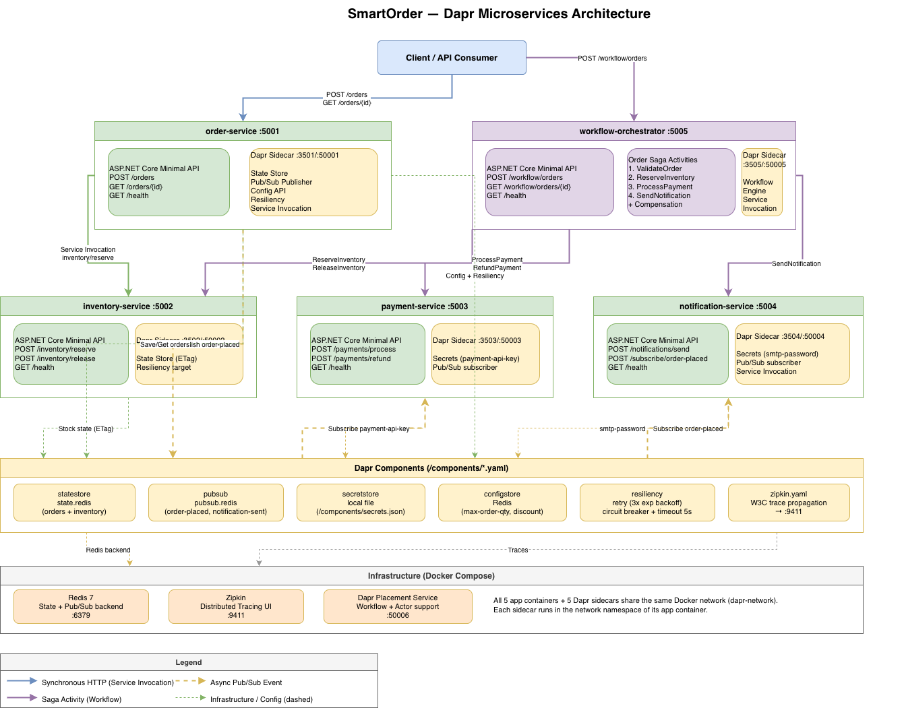

# SmartOrder

A .NET 10 multi-microservice application demonstrating all major Dapr building blocks through a realistic order processing system.

---

## Architecture



```
┌─────────────────────────────────────────────────────────────────┐
│                        Client / API Consumer                    │
└──────────────────────────┬──────────────────────────────────────┘
                           │
          ┌────────────────▼────────────────┐
          │         order-service :5001      │
          │  - Creates orders               │
          │  - Validates via FluentValidation│
          │  - Reads config (max qty, disc.) │
          │  - Saves state to Redis          │
          │  - Invokes inventory-service     │
          │  - Publishes order-placed event  │
          └──────┬──────────────────────────┘
                 │ Dapr service invocation
    ┌────────────▼────────────┐
    │  inventory-service :5002 │
    │  - Reserves/releases     │
    │    stock in Redis        │
    │  - ETag optimistic lock  │
    └─────────────────────────┘

          ┌──────────────────────────────────┐
          │   workflow-orchestrator :5005     │
          │  Saga: ValidateOrder →            │
          │        ReserveInventory →         │
          │        ProcessPayment →           │
          │        SendNotification           │
          │  Compensation on failure          │
          └──┬──────────┬──────────┬─────────┘
             │          │          │
    ┌────────▼──┐ ┌─────▼────┐ ┌──▼──────────────┐
    │ inventory │ │ payment  │ │ notification     │
    │ :5002     │ │ :5003    │ │ :5004            │
    └───────────┘ └──────────┘ └─────────────────┘

Pub/Sub (Redis Streams):
  order-service ──► order-placed ──► payment-service
                                 └──► notification-service
```

Each service runs with a **Dapr sidecar** (`daprd`) in the same network namespace. All inter-service communication goes through the sidecar — never direct HTTP.

---

## Services

| Service | Port | Responsibility |
|---|---|---|
| order-service | 5001 | Order creation, validation, state, pub/sub |
| inventory-service | 5002 | Stock reservation and release |
| payment-service | 5003 | Payment processing, secrets |
| notification-service | 5004 | Notifications via pub/sub and direct invocation |
| workflow-orchestrator | 5005 | Order saga orchestration |

---

## Dapr Building Blocks Implemented

### 1. Service Invocation

Synchronous service-to-service calls routed through the Dapr sidecar. No `HttpClient`, no hardcoded URLs — just app IDs.

```csharp
// order-service → inventory-service
await _daprClient.InvokeMethodAsync<ReserveInventoryRequest, ReserveInventoryResponse>(
    "inventory-service",   // Dapr app ID
    "inventory/reserve",   // method path
    request,
    cancellationToken);
```

Where it's used: `src/OrderService/Services/DaprInventoryClient.cs`

The workflow activities also use service invocation to call `inventory-service`, `payment-service`, and `notification-service` during saga execution.

---

### 2. State Management

Persistent key/value state backed by Redis. Uses strong consistency and ETags for optimistic concurrency control.

```csharp
// Save with atomic transaction
var operations = new List<StateTransactionRequest>
{
    new($"order-{order.OrderId}",
        JsonSerializer.SerializeToUtf8Bytes(order),
        StateOperationType.Upsert,
        options: new StateOptions { Consistency = ConsistencyMode.Strong })
};
await _daprClient.ExecuteStateTransactionAsync("statestore", operations, cancellationToken);

// Read with ETag for optimistic locking
var (state, etag) = await _daprClient.GetStateAndETagAsync<Order>("statestore", key, cancellationToken);

// Conditional update — retries on conflict
var saved = await _daprClient.TrySaveStateAsync("statestore", key, updated, etag, options, cancellationToken);
```

Key pattern: `{entity-type}-{id}` — e.g. `order-abc123`, `inventory-prod-001`

Where it's used:
- `src/OrderService/Services/OrderStateService.cs` — order persistence
- `src/InventoryService/Services/InventoryService.cs` — stock levels

---

### 3. Pub/Sub Messaging

Async event-driven communication via Redis Streams. Publishers and subscribers are fully decoupled.

**Publishing** (order-service):
```csharp
await _daprClient.PublishEventAsync("pubsub", "order-placed", orderPlacedEvent, cancellationToken);
```

**Subscribing** (notification-service):
```csharp
app.MapPost("/subscribe/order-placed",
    [Topic("pubsub", "order-placed", "order-placed-deadletter", false)]
    async (OrderPlacedEvent orderEvent, ...) => { ... });
```

Topics: `order-placed`, `payment-processed`, `notification-sent`

Each topic has a dead-letter topic (`{topic}-deadletter`). Subscribers return:
- `200 OK` — message processed successfully
- `404` — drop the message
- `500` — trigger a retry

Where it's used:
- `src/OrderService/Services/OrderService.cs` — publishes `order-placed`
- `src/NotificationService/Endpoints/NotificationEndpoints.cs` — subscribes to `order-placed`
- `src/NotificationService/Services/NotificationService.cs` — publishes `notification-sent`

---

### 4. Secrets Management

Secrets are never in `appsettings.json` or environment variables. All secrets are fetched at runtime from the Dapr secret store.

```csharp
var secrets = await _daprClient.GetSecretAsync(
    "secretstore",
    "payment-api-key",
    cancellationToken: cancellationToken);

_paymentApiKey = secrets["payment-api-key"];
```

Local dev uses a file-based secret store pointing to `components/secrets.json`. The same code works against AWS Secrets Manager in production by swapping the component YAML.

Where it's used:
- `src/PaymentService/Services/PaymentService.cs` — `payment-api-key`
- `src/NotificationService/Services/NotificationService.cs` — `smtp-password`

---

### 5. Configuration API

Feature flags loaded from the Dapr configuration store at startup, with live hot-reload via subscription — no service restart needed.

```csharp
// Initial load
var config = await _daprClient.GetConfiguration(
    "configstore",
    new[] { "max-order-quantity", "discount-enabled" },
    cancellationToken: cancellationToken);

// Hot-reload subscription
var subscription = await _daprClient.SubscribeConfiguration("configstore", keys, cancellationToken);
await foreach (var items in subscription.Source.WithCancellation(cancellationToken))
{
    ApplyConfig(items); // updates in-memory values without restart
}
```

Where it's used: `src/OrderService/Services/ConfigurationService.cs`

---

### 6. Workflow (Saga Pattern)

Durable, fault-tolerant saga orchestration using Dapr Workflow. Each step is a `WorkflowActivity`. On failure, compensation activities roll back completed steps.

```
ValidateOrder → ReserveInventory → ProcessPayment → SendNotification
                      ↑                   ↑
              (compensation)      ReleaseInventory + RefundPayment
```

```csharp
public class OrderSagaWorkflow : Workflow<OrderSagaInput, OrderSagaResult>
{
    public override async Task<OrderSagaResult> RunAsync(WorkflowContext context, OrderSagaInput input)
    {
        var validation = await context.CallActivityAsync<ValidationResult>(
            nameof(ValidateOrderActivity), ...);

        var reservation = await context.CallActivityAsync<ReservationResult>(
            nameof(ReserveInventoryActivity), ...);

        var payment = await context.CallActivityAsync<PaymentResult>(
            nameof(ProcessPaymentActivity), ...);

        if (!payment.Success)
        {
            // Compensate
            await context.CallActivityAsync<bool>(nameof(ReleaseInventoryReservationActivity), ...);
            await context.CallActivityAsync<bool>(nameof(RefundPaymentActivity), ...);
            return new OrderSagaResult(false, payment.FailureReason);
        }

        await context.CallActivityAsync<NotificationResult>(nameof(SendNotificationActivity), ...);
        return new OrderSagaResult(true, null);
    }
}
```

Workflow status values: `0=Running`, `1=Completed`, `2=Failed`, `3=Terminated`

Where it's used: `src/WorkflowOrchestrator/Components/`

---

### 7. Resiliency

Retry, circuit breaker, and timeout policies defined declaratively in YAML — no code changes needed.

```yaml
# components/resiliency.yaml
spec:
  policies:
    retries:
      retryThreeTimes:
        policy: exponential
        maxRetries: 3
        maxInterval: 10s
    circuitBreakers:
      simpleCB:
        maxRequests: 1
        interval: 10s
        timeout: 30s
        trip: consecutiveFailures >= 5
    timeouts:
      general: 5s
  targets:
    apps:
      inventory-service:
        retry: retryThreeTimes
        circuitBreaker: simpleCB
        timeout: general
```

Applied to: `order-service` → `inventory-service` calls

---

### 8. Observability (Distributed Tracing)

W3C trace context propagated automatically across all services via Dapr. Traces exported to Zipkin.

```csharp
// Structured logging with trace correlation
using (_logger.BeginScope(new Dictionary<string, object>
{
    ["TraceId"] = Activity.Current?.TraceId.ToString() ?? string.Empty,
    ["SpanId"]  = Activity.Current?.SpanId.ToString() ?? string.Empty,
    ["OrderId"] = orderId,
    ["ServiceName"] = "order-service"
}))
{
    _logger.LogInformation("Order {OrderId} created", orderId);
}
```

Zipkin UI: http://localhost:9411

---

## How to Run Locally

### Prerequisites

- [Docker Desktop](https://www.docker.com/products/docker-desktop/) (with Compose v2)
- No Dapr CLI needed — everything runs inside containers

### 1. Start the stack

```bash
docker compose up -d
```

This starts: Redis, Zipkin, Dapr placement service, all 5 app containers, and their 5 Dapr sidecars (13 containers total).

Wait ~15 seconds for all services to become healthy.

### 2. Verify all services are up

```bash
curl http://localhost:5001/health   # order-service
curl http://localhost:5002/health   # inventory-service
curl http://localhost:5003/health   # payment-service
curl http://localhost:5004/health   # notification-service
curl http://localhost:5005/health   # workflow-orchestrator
```

### 3. Seed inventory

Inventory state must be seeded before placing orders:

```bash
docker compose exec inventory-service curl -s -X POST http://localhost:3502/v1.0/state/statestore \
  -H "Content-Type: application/json" \
  -d '[{"key":"inventory-prod-001","value":{"productId":"prod-001","availableQuantity":100,"reservedQuantity":0}}]'
```

### 4. Place an order

```bash
curl -X POST http://localhost:5001/orders \
  -H "Content-Type: application/json" \
  -d '{"productId":"prod-001","quantity":2,"price":29.99}'
```

### 5. Run the full order saga

```bash
curl -X POST http://localhost:5005/workflow/orders \
  -H "Content-Type: application/json" \
  -d '{"productId":"prod-001","quantity":2,"price":29.99,"customerId":"cust-123"}'
```

Copy the `instanceId` from the response, then poll for completion:

```bash
curl http://localhost:5005/workflow/orders/{instanceId}
# {"status":1} = Completed
```

### 6. Run the smoke test suite

```bash
bash tests/smoke-test.sh
```

Runs 29 tests covering all APIs, validation rules, error cases, and the full saga end-to-end.

> Windows users: run this from WSL2 or Git Bash. The script requires bash and `curl`.

### 7. Run unit tests

```bash
dotnet test
```

### 8. View distributed traces

Open http://localhost:9411 in your browser to see Zipkin traces across all services.

### Stop the stack

```bash
docker compose down
```

---

## API Reference

### order-service (port 5001)

| Method | Path | Description |
|---|---|---|
| POST | `/orders` | Create an order |
| GET | `/orders/{orderId}` | Get order by ID |
| GET | `/health` | Health check |

**POST /orders body:**
```json
{ "productId": "prod-001", "quantity": 2, "price": 29.99 }
```

Validation rules: quantity ≥ 1, price > 0, quantity ≤ 100 (configurable via config store)

### inventory-service (port 5002)

| Method | Path | Description |
|---|---|---|
| POST | `/inventory/reserve` | Reserve stock |
| POST | `/inventory/release` | Release reserved stock |
| GET | `/health` | Health check |

### payment-service (port 5003)

| Method | Path | Description |
|---|---|---|
| POST | `/payments/process` | Process a payment |
| POST | `/payments/refund` | Refund a payment |
| GET | `/health` | Health check |

### notification-service (port 5004)

| Method | Path | Description |
|---|---|---|
| POST | `/notifications/send` | Send notification (direct invocation) |
| POST | `/subscribe/order-placed` | Pub/sub subscriber (Dapr-managed) |
| GET | `/health` | Health check |

### workflow-orchestrator (port 5005)

| Method | Path | Description |
|---|---|---|
| POST | `/workflow/orders` | Start order saga |
| GET | `/workflow/orders/{instanceId}` | Get saga status |
| GET | `/health` | Health check |

---

## Project Structure

```
SmartOrder/
├── src/
│   ├── OrderService/           # Order creation, state, pub/sub, config
│   ├── InventoryService/       # Stock management with ETags
│   ├── PaymentService/         # Payment processing, secrets
│   ├── NotificationService/    # Pub/sub subscriber + direct invocation
│   └── WorkflowOrchestrator/   # Dapr Workflow saga + activities
├── tests/
│   ├── OrderService.Tests/     # Unit + property-based tests
│   ├── InventoryService.Tests/
│   ├── PaymentService.Tests/
│   ├── NotificationService.Tests/
│   ├── Integration.Tests/      # Testcontainers integration tests
│   └── smoke-test.sh           # Live API smoke test suite (29 tests)
├── components/                 # Dapr component YAML files
│   ├── statestore.yaml         # Redis state store
│   ├── pubsub.yaml             # Redis pub/sub
│   ├── secretstore.yaml        # Local file secret store
│   ├── resiliency.yaml         # Retry, circuit breaker, timeout policies
│   ├── zipkin.yaml             # Distributed tracing config
│   └── secrets.json            # Local dev secrets (never commit real secrets)
└── docker-compose.yml          # Full stack: 5 apps + 5 sidecars + infra
```

---

## Important Notes

**Always do a full `docker compose down` + `docker compose up -d` when rebuilding.** Never restart just the app container without its sidecar — the sidecar shares the app container's network namespace and will lose connectivity if the app container is recreated independently.

**Inventory must be seeded on every fresh stack start.** Redis data is not persisted between `docker compose down` runs by default.

**The workflow-orchestrator and order-service are separate flows.** `POST /orders` creates an order and reserves inventory directly. `POST /workflow/orders` runs the full durable saga. Both are valid entry points for different use cases.

**Component scopes** control which services can access which Dapr components. See the `scopes` field in each YAML under `components/`. For example, only `order-service`, `inventory-service`, and `workflow-orchestrator` have access to the state store.
